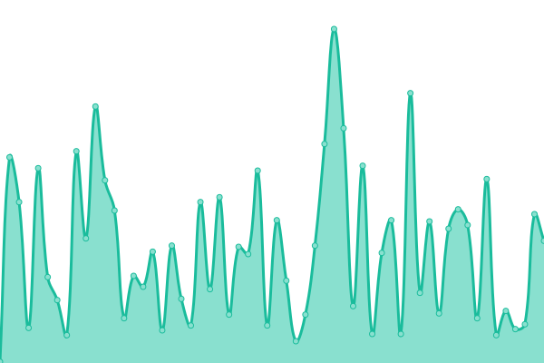

# [📈 Live Status](https://nup.expo.moe): <!--live status--> **🟩 All systems operational**

This repository contains the open-source uptime monitor and status page [Upptime](https://github.com/upptime/upptime).

<!--start: status pages-->
<!-- This summary is generated by Upptime (https://github.com/upptime/upptime) -->
<!-- Do not edit this manually, your changes will be overwritten -->
<!-- prettier-ignore -->
| URL | Status | History | Response Time | Uptime |
| --- | ------ | ------- | ------------- | ------ |
|  [Personal: AA](https://aim.femboy.cafe) | 🟩 Up | [personal-aa.yml](https://github.com/ignore-me-lol/personal-uptime-monitor/commits/HEAD/history/personal-aa.yml) | 

 959ms
     
 | 

<a href="https://nup.expo.moe/history/personal-aa">98.96%</a>
    

|  [Rbux: Frontend](https://rbux.pw) | 🟩 Up | [rbux-frontend.yml](https://github.com/ignore-me-lol/personal-uptime-monitor/commits/HEAD/history/rbux-frontend.yml) | 

 825ms
     
 | 

<a href="https://nup.expo.moe/history/rbux-frontend">98.76%</a>
    

|  [Rbux: Backend](https://api.rbux.pw/app/leaderboard) | 🟩 Up | [rbux-backend.yml](https://github.com/ignore-me-lol/personal-uptime-monitor/commits/HEAD/history/rbux-backend.yml) | 

 498ms
     
 | 

<a href="https://nup.expo.moe/history/rbux-backend">98.78%</a>
    

|  [Nexus: Landing](https://nexuspipe.com) | 🟩 Up | [nexus-landing.yml](https://github.com/ignore-me-lol/personal-uptime-monitor/commits/HEAD/history/nexus-landing.yml) | 

 852ms
     
 | 

<a href="https://nup.expo.moe/history/nexus-landing">97.40%</a>
    

|  [Nexus: Docs](https://docs.nexuspipe.com) | 🟩 Up | [nexus-docs.yml](https://github.com/ignore-me-lol/personal-uptime-monitor/commits/HEAD/history/nexus-docs.yml) | 

 765ms
     
 | 

<a href="https://nup.expo.moe/history/nexus-docs">98.79%</a>
    

|  [Nexus: Dashboard](https://dash.nexuspipe.com) | 🟩 Up | [nexus-dashboard.yml](https://github.com/ignore-me-lol/personal-uptime-monitor/commits/HEAD/history/nexus-dashboard.yml) | 

 836ms
     
 | 

<a href="https://nup.expo.moe/history/nexus-dashboard">98.98%</a>
    

|  [Nexus: Fonts](https://fonts.nexuspipe.com) | 🟩 Up | [nexus-fonts.yml](https://github.com/ignore-me-lol/personal-uptime-monitor/commits/HEAD/history/nexus-fonts.yml) | 

 452ms
     
 | 

<a href="https://nup.expo.moe/history/nexus-fonts">97.54%</a>
    

|  [Nexus: Fonts CDN](https://fonts-cdn.nexuspipe.com) | 🟩 Up | [nexus-fonts-cdn.yml](https://github.com/ignore-me-lol/personal-uptime-monitor/commits/HEAD/history/nexus-fonts-cdn.yml) | 

 1294ms
     
 | 

<a href="https://nup.expo.moe/history/nexus-fonts-cdn">90.68%</a>
    

<!--end: status pages-->

[**status →**](https://nup.expo.moe)

## 📄 License

- Powered by: [Upptime](https://github.com/upptime/upptime)
- Code: [MIT](./LICENSE)
- Data in the `./history` directory: [Open Database License](https://opendatacommons.org/licenses/odbl/1-0/)
